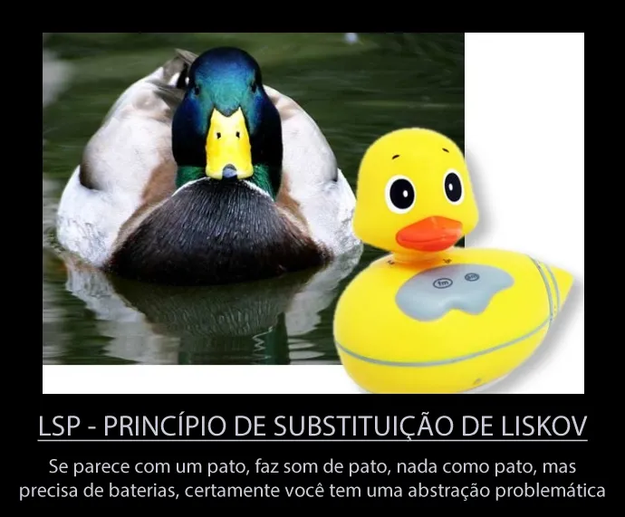

### Liskov Substitution Principle

O Liskov Substitution Principle (LSP) ou Princípio de Substituição de Liskov está diretamente ligado ao OCP (Open Closed Principle) foi criado por Barbara Liskov uma grande cientista da computação americana.

O LSP tem como objetivo nos alertar quanto a utilização da herança, que é um poderoso mecanismo e deve ser utilizado com extrema parcimônia. O princípio é baseado na seguinte premissa:

>As classes derivadas devem ser substituíveis por suas classes bases.

A premissa acima é uma forma mais simples de explicar a premissa verdadeira do princípio que é:

> Se para cada objeto x1 do tipo S há um objeto x2 do tipo T de tal forma que, para todos os programas P definidos em termos de T, o comportamento de P não muda quando x1 é substituído por x2 então S é um subtipo de T. (ref)

Existe até uma brincadeira que diz o seguinte:

**Vamos ver essa premissa em código?**

~~~
public class T { //... }

public class S : T { //... }

public static class ProgramP
{
    public static string AcceptObject(T obj)
    {
        return "ok !";
    }        
}

class Program
{
    static void Main(string[] args)
    {
        var x1 = new T();
        var x2 = new S();
        
        //Aceita o objeto do tipo T
        Console.WriteLine(ProgramP.AcceptObject(x1));
        
        //Aceita objeto do tipo S que é um subtipo de T
        Console.WriteLine(ProgramP.AcceptObject(x2));
    }
}
~~~

Perfeito, dessa forma fica bem mais claro o que o princípio orienta não?

**Que tal vermos agora alguns exemplos de violação do princípio?**

Sobrescrever um método deixando-o vazio

~~~
public class Conta{
  public virtual void Cobrar(decimal valor)
  {
    return valor * 10;
  }
}

public class ContaGratuita : Conta{
  public override void Cobrar(decimal valor)
  {
    //Não faz nada aqui 
  }
}
~~~

Esse tipo de violação é sutil, mas se a subclasse não altera ou sobrescreve realmente o código. será que podemos considera-la uma especialização da classe base?

...

Lançando uma exceção inesperada

~~~
public class Ave
{
    public virtual void Voar()
    {
        //...
    }
}

public class Pinguim : Ave
{
    public override void Voar()
    {
        throw new Exception("Não rola brother... : (");
    }
}
~~~

Se na classe base não lançamos nenhuma exception ou lançamos exception para outros tipos somente, o código não saberá como trata-la e com isso fará o sistema “voar”.

...

O exemplo clássico do retângulo e quadrado

A geometria nos afirma que todo quadrado é um retângulo, mas, quando estamos desenvolvendo não podemos levar essa afirmativa ao pé da letra. Perceba que no exemplo acima definimos o valor da altura igual ao da sua largura no quadrado, dessa forma deixamos explicito que nem sempre um quadrado é um retângulo e vemos um tipo clássico de violação do LSP.

Bom, acredito ter deixado um pouco mais claro esse principio. Não deixem de acompanhar os próximos post sobre SOLID.

---

Fonte: [Solid — L.S.P — Liskov Substitution Principle: Thiago Arahão](https://medium.com/@tbaragao/solid-l-s-p-liskov-substitution-principle-3a31c3a7b49e)